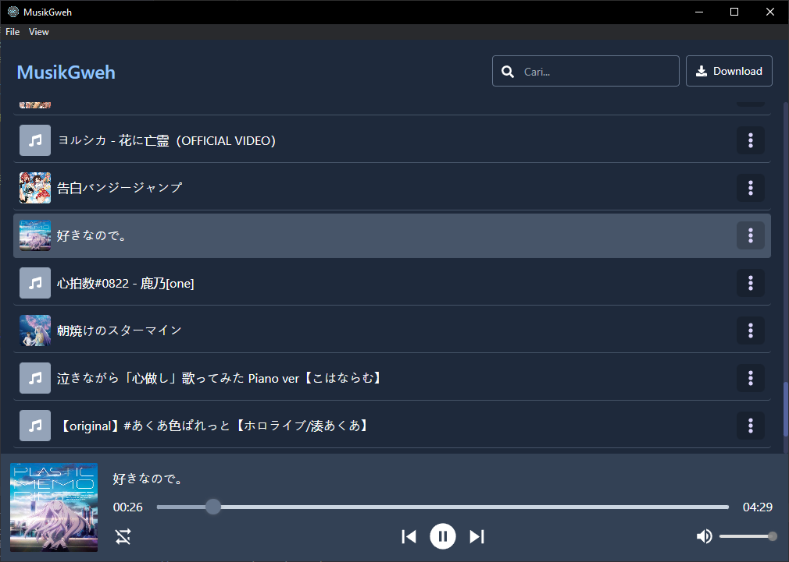

# MusikGweh

Music Player made with Electron, ReactJs, & Nodejs using ytdl-core and ffmpeg to download and convert audio from YouTube.

Bootstrapped using [electron-react-boilerplate](https://github.com/electron-react-boilerplate/electron-react-boilerplate)

<div style="text-align: center;">
    
</div>

## Install

Clone the repo and install dependencies:

```bash
git clone https://github.com/khairul169/MusikGweh.git
cd MusikGweh
npm install
```

## Starting Development

Start the app in the `dev` environment:

```bash
npm start
```

## Packaging for Production

To package apps for the local platform:

```bash
npm run package
```
